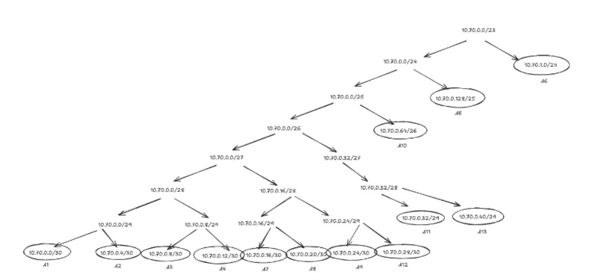

# Jarkom-Modul-5-2025-K13

## Topologi


## Tabel Subnet
| Subnet | Jumlah IP | Prefix |
|--------|-----------|--------|
| A1     | 2         | /30    |
| A2     | 2         | /30    |
| A3     | 2         | /30    |
| A4     | 2         | /30    |
| A5     | 121       | /25    |
| A6     | 231       | /24    |
| A7     | 2         | /30    |
| A8     | 2         | /30    |
| A9     | 2         | /30    |
| A10    | 51        | /26    |
| A11    | 6         | /29    |
| A12    | 3         | /29    |
| A13    | 3         | /29    |
| TOTAL  | 428       | /23    |

## VLSM TREE



## Tabel VLSM

| Subnet | Jumlah IP | Prefix | Network ID  | Range                    | Broadcast  | Netmask         |
|--------|-----------|--------|-------------|---------------------------|------------|------------------|
| A1     | 2         | /30    | 10.70.0.0   | 10.70.0.1–10.70.0.2      | 10.70.0.3  | 255.255.255.252 |
| A2     | 2         | /30    | 10.70.0.4   | 10.70.0.5–10.70.0.6      | 10.70.0.7  | 255.255.255.252 |
| A3     | 2         | /30    | 10.70.0.8   | 10.70.0.9–10.70.0.10     | 10.70.0.11 | 255.255.255.252 |
| A4     | 2         | /30    | 10.70.0.12  | 10.70.0.13–10.70.0.14    | 10.70.0.15 | 255.255.255.252 |
| A5     | 121       | /25    | 10.70.0.128 | 10.70.0.129–10.70.0.254  | 10.70.0.255| 255.255.255.128 |
| A6     | 231       | /24    | 10.70.1.0   | 10.70.1.1–10.70.1.254    | 10.70.1.255| 255.255.255.0   |
| A7     | 2         | /30    | 10.70.0.16  | 10.70.0.17–10.70.0.18    | 10.70.0.19 | 255.255.255.252 |
| A8     | 2         | /30    | 10.70.0.20  | 10.70.0.21–10.70.0.22    | 10.70.0.23 | 255.255.255.252 |
| A9     | 2         | /30    | 10.70.0.24  | 10.70.0.25–10.70.0.26    | 10.70.0.27 | 255.255.255.252 |
| A10    | 51        | /26    | 10.70.0.192 | 10.70.0.193–10.70.0.254  | 10.70.0.255| 255.255.255.192 |
| A11    | 6         | /29    | 10.70.0.32  | 10.70.0.33–10.70.0.38    | 10.70.0.39 | 255.255.255.248 |
| A12    | 3         | /29    | 10.70.0.28  | 10.70.0.29–10.70.0.30    | 10.70.0.31 | 255.255.255.248 |
| A13    | 3         | /29    | 10.70.0.40  | 10.70.0.41–10.70.0.46    | 10.70.0.47 | 255.255.255.248 |

### Misi 1: Memetakan Medan Perang

### Konfigurasi IP Address

### Osgiliath
```bash
cat << EOF > /etc/network/interfaces
auto lo
iface lo inet loopback

# Ke NAT1 (internal NAT GNS3)
auto eth0
iface eth0 inet dhcp

# A12: Osgiliath <-> Rivendell
auto eth1
iface eth1 inet static
    address 10.70.0.29
    netmask 255.255.255.252

# A7: Osgiliath <-> Moria
auto eth2
iface eth2 inet static
    address 10.70.0.17
    netmask 255.255.255.252

# A1: Osgiliath <-> DHCP Relay MinasTir
auto eth3
iface eth3 inet static
    address 10.70.0.1
    netmask 255.255.255.252
EOF

# Aktifkan IP forwarding
echo 1 > /proc/sys/net/ipv4/ip_forward

# ===== Sisi kanan (MinasTir, Pelargir, AnduinBanks, A5, A6) via 10.70.0.2 =====
route add -net 10.70.0.4 netmask 255.255.255.252 gw 10.70.0.2   # A2
route add -net 10.70.0.8 netmask 255.255.255.252 gw 10.70.0.2   # A3
route add -net 10.70.0.12 netmask 255.255.255.252 gw 10.70.0.2   # A4
route add -net 10.70.0.128 netmask 255.255.255.128 gw 10.70.0.2   # A5
route add -net 10.70.1.0 netmask 255.255.255.0   gw 10.70.0.2   # A6

# ===== Sisi kiri (Moria, Winterland, Durin, Khamul, IronHills) via 10.70.0.18 =====
route add -net 10.70.0.20 netmask 255.255.255.252 gw 10.70.0.18  # A8
route add -net 10.70.0.24 netmask 255.255.255.252 gw 10.70.0.18  # A9
route add -net 10.70.0.64 netmask 255.255.255.192 gw 10.70.0.18  # A10
route add -net 10.70.0.32 netmask 255.255.255.248 gw 10.70.0.18  # A11

# ===== Bawah (Rivendell, Vilya, Narya) via 10.70.0.30 =====
route add -net 10.70.0.40 netmask 255.255.255.248 gw 10.70.0.30  # A13

```

### Minastir (DHCP Relay)
```bash
cat << EOF > /etc/network/interfaces
auto lo
iface lo inet loopback

# A1: ke Osgiliath
auto eth0
iface eth0 inet static
    address 10.70.0.2
    netmask 255.255.255.252
#    gateway 10.70.0.1   

# A6: LAN Elendil + Isildur
auto eth1
iface eth1 inet static
    address 10.70.1.1
    netmask 255.255.255.0

# A2: ke Pelargir
auto eth2
iface eth2 inet static
    address 10.70.0.5
    netmask 255.255.255.252

EOF

echo "nameserver 192.168.122.1" > /etc/resolv.conf
echo 1 > /proc/sys/net/ipv4/ip_forward
route add -net 10.70.0.8   netmask 255.255.255.252 gw 10.70.0.6   # A3
route add -net 10.70.0.12  netmask 255.255.255.252 gw 10.70.0.6   # A4
route add -net 10.70.0.128 netmask 255.255.255.128 gw 10.70.0.6   # A5

route add -net 10.70.0.16 netmask 255.255.255.252 gw 10.70.0.1 # A7
route add -net 10.70.0.20 netmask 255.255.255.252 gw 10.70.0.1 # A8
route add -net 10.70.0.24 netmask 255.255.255.252 gw 10.70.0.1 # A9
route add -net 10.70.0.64 netmask 255.255.255.192 gw 10.70.0.1 # A10
route add -net 10.70.0.32 netmask 255.255.255.248 gw 10.70.0.1 # A11
route add -net 10.70.0.28 netmask 255.255.255.252 gw 10.70.0.1 # A12
route add -net 10.70.0.40 netmask 255.255.255.248 gw 10.70.0.1 # A13

```
### Pelargir
```bash
cat << EOF > /etc/network/interfaces
auto eth0
iface eth0 inet static
    address 10.70.0.6
    netmask 255.255.255.252

# A3: ke AnduinBanks
auto eth1
iface eth1 inet static
    address 10.70.0.13
    netmask 255.255.255.252

# A4: link ke Palantir (Web Server 2)
auto eth2
iface eth2 inet static
    address 10.70.0.9
    netmask 255.255.255.252

EOF
echo "nameserver 192.168.122.1" > /etc/resolv.conf
echo 1 > /proc/sys/net/ipv4/ip_forward
route add default gw 10.70.0.5
route add -net 10.70.0.0 netmask 255.255.255.128 gw 10.70.0.5   # A1
route add -net 10.70.0.128 netmask 255.255.255.128 gw 10.70.0.10   # A5
route add -net 10.70.1.0 netmask 255.255.255.0 gw 10.70.0.5   # A6
route add -net 10.70.0.16 netmask 255.255.255.252 gw 10.70.0.5   # A7
route add -net 10.70.0.20 netmask 255.255.255.252 gw 10.70.0.5   # A8
route add -net 10.70.0.24 netmask 255.255.255.252 gw 10.70.0.10   # A9
route add -net 10.70.0.64 netmask 255.255.255.192 gw 10.70.0.10   # A10
route add -net 10.70.0.32 netmask 255.255.255.248 gw 10.70.0.5   # A11
route add -net 10.70.0.28 netmask 255.255.255.252 gw 10.70.0.5   # A12
route add -net 10.70.0.40 netmask 255.255.255.248 gw 10.70.0.5   # A13
```

### AnduinBanks (DHCp Relay)
```bash
cat << EOF > /etc/network/interfaces
auto lo
iface lo inet loopback

# A3: ke Pelargir
auto eth0
iface eth0 inet static
    address 10.70.0.10
    netmask 255.255.255.252

# A5: LAN Gilgalad + Cirdan
auto eth1
iface eth1 inet static
    address 10.70.0.129
    netmask 255.255.255.128

echo "nameserver 192.168.122.1" > /etc/resolv.conf
echo 1 > /proc/sys/net/ipv4/ip_forward
route add default gw 10.70.0.9
route add -net 10.70.0.0 netmask 255.255.255.252 gw 10.70.0.9   # A1
route add -net 10.70.0.4 netmask 255.255.255.252 gw 10.70.0.9   # A2
route add -net 10.70.0.12 netmask 255.255.255.252 gw 10.70.0.9   # A4
route add -net 10.70.1.0 netmask 255.255.255.0 gw 10.70.0.9   # A6
route add -net 10.70.0.16 netmask 255.255.255.252 gw 10.70.0.9   # A7
route add -net 10.70.0.20 netmask 255.255.255.252 gw 10.70.0.9   # A8
route add -net 10.70.0.24 netmask 255.255.255.252 gw 10.70.0.9   # A9
route add -net 10.70.0.64 netmask 255.255.255.192 gw 10.70.0.9   # A10
route add -net 10.70.0.32 netmask 255.255.255.248 gw 10.70.0.9   # A11
route add -net 10.70.0.28 netmask 255.255.255.252 gw 10.70.0.9   # A12
route add -net 10.70.0.40 netmask 255.255.255.248 gw 10.70.0.9   # A13
```

### Cirdan
```bash
# Client
# Konfigurasi IP Static
cat << EOF > /etc/network/interfaces
auto lo
iface lo inet loopback

auto eth0
iface eth0 inet dhcp
EOF

echo "nameserver 192.168.122.1" > /etc/resolv.conf
```

### Gilgalad
```bash
# Client
# Konfigurasi IP Static
cat << EOF > /etc/network/interfaces
auto lo
iface lo inet loopback

auto eth0
iface eth0 inet dhcp
EOF

echo "nameserver 192.168.122.1" > /etc/resolv.conf
```

### Palantir (Web Server 2)
```bash
cat << EOF > /etc/network/interfaces
auto lo
iface lo inet loopback

auto eth0
iface eth0 inet static
    address 10.70.0.14
    netmask 255.255.255.252
    gateway 10.70.0.13      # Pelargir eth2
EOF

echo "nameserver 192.168.122.1" > /etc/resolv.conf
```

### Isildur
```bash
# Client
# Konfigurasi IP Static
cat << EOF > /etc/network/interfaces
auto lo
iface lo inet loopback

auto eth0
iface eth0 inet dhcp
EOF

echo "nameserver 192.168.122.1" > /etc/resolv.conf
```

### Elendil
```bash
# Client
# Konfigurasi IP Static
cat << EOF > /etc/network/interfaces
auto lo
iface lo inet loopback

auto eth0
iface eth0 inet dhcp
EOF

echo "nameserver 192.168.122.1" > /etc/resolv.conf
```

### Rivendell (DHCP Relay)
```bash
cat << EOF > /etc/network/interfaces
auto lo
iface lo inet loopback

# A12: ke Osgiliath
auto eth0
iface eth0 inet static
    address 10.70.0.30
    netmask 255.255.255.252

# A13: LAN Vilya + Narya + DHCP Relay
auto eth1
iface eth1 inet static
    address 10.70.0.41
    netmask 255.255.255.248
EOF

echo "nameserver 192.168.122.1" > /etc/resolv.conf
echo 1 > /proc/sys/net/ipv4/ip_forward
route add default gw 10.70.0.29
route add -net 10.70.0.0 netmask 255.255.255.252 gw 10.70.0.29   # A1
route add -net 10.70.0.4 netmask 255.255.255.252 gw 10.70.0.29   # A2
route add -net 10.70.0.8 netmask 255.255.255.252 gw 10.70.0.29   # A3
route add -net 10.70.0.12 netmask 255.255.255.252 gw 10.70.0.29   # A4
route add -net 10.70.0.128 netmask 255.255.255.128 gw 10.70.0.29   # A5
route add -net 10.70.1.0 netmask 255.255.255.0   gw 10.70.0.29   # A6
route add -net 10.70.0.16 netmask 255.255.255.252 gw 10.70.0.29  # A7
route add -net 10.70.0.20 netmask 255.255.255.252 gw 10.70.0.29  # A8
route add -net 10.70.0.24 netmask 255.255.255.252 gw 10.70.0.29  # A9
route add -net 10.70.0.64 netmask 255.255.255.192 gw 10.70.0.29  # A10
route add -net 10.70.0.32 netmask 255.255.255.248 gw 10.70.0.29  # A11
```
### Vilya (DHCP Server)
```bash
cat << EOF > /etc/network/interfaces
auto lo
iface lo inet loopback

auto eth0
iface eth0 inet static
    address 10.70.0.43
    netmask 255.255.255.248
    gateway 10.70.0.41
EOF

echo "nameserver 192.168.122.1" > /etc/resolv.conf
```

### Narya (DNS Server)
```bash
cat << EOF > /etc/network/interfaces
auto lo
iface lo inet loopback

auto eth0
iface eth0 inet static
    address 10.70.0.42
    netmask 255.255.255.248
    gateway 10.70.0.41

EOF

echo "nameserver 192.168.122.1" > /etc/resolv.conf
```

### Moria
```bash
cat << EOF > /etc/network/interfaces
auto lo
iface lo inet loopback

# A7: ke Osgiliath
auto eth0
iface eth0 inet static
    address 10.70.0.18
    netmask 255.255.255.252

# A8: LAN kecil dengan IronHills (via Switch2)
auto eth1
iface eth1 inet static
    address 10.70.0.21
    netmask 255.255.255.252

# A9: ke Winterland
auto eth2
iface eth2 inet static
    address 10.70.0.25
    netmask 255.255.255.252

EOF

echo "nameserver 192.168.122.1" > /etc/resolv.conf
echo 1 > /proc/sys/net/ipv4/ip_forward
route add default gw 10.70.0.17
route add -net 10.70.0.0 netmask 255.255.255.252 gw 10.70.0.17   # A1
route add -net 10.70.0.4 netmask 255.255.255.252 gw 10.70.0.17   # A2
route add -net 10.70.0.8 netmask 255.255.255.252 gw 10.70.0.17   # A3
route add -net 10.70.0.12 netmask 255.255.255.252 gw 10.70.0.17   # A4
route add -net 10.70.0.128 netmask 255.255.255.128 gw 10.70.0.17   # A5
route add -net 10.70.1.0 netmask 255.255.255.0   gw 10.70.0.17   # A6

route add -net 10.70.0.64 netmask 255.255.255.192 gw 10.70.0.26  # A10
route add -net 10.70.0.32 netmask 255.255.255.248 gw 10.70.0.26  # A1
route add -net 10.70.0.28  netmask 255.255.255.252 gw 10.70.0.17  # A10
route add -net 10.70.0.40  netmask 255.255.255.248 gw 10.70.0.17  # A11
```

### Wilderland (DHCP Relay)
```bash
cat << EOF > /etc/network/interfaces
auto lo
iface lo inet loopback

# A9: ke Moria
auto eth0
iface eth0 inet static
    address 10.70.0.26
    netmask 255.255.255.252

# A10: LAN Durin (+ IronHills via Switch2)
auto eth1
iface eth1 inet static
    address 10.70.0.65
    netmask 255.255.255.192

# A11: LAN Khamul
auto eth2
iface eth2 inet static
    address 10.70.0.33
    netmask 255.255.255.248
EOF

echo "nameserver 192.168.122.1" > /etc/resolv.conf
echo 1 > /proc/sys/net/ipv4/ip_forward
route add default gw 10.70.0.25
route add -net 10.70.0.0 netmask 255.255.255.252 gw 10.70.0.25   # A1
route add -net 10.70.0.4 netmask 255.255.255.252 gw 10.70.0.25   # A2
route add -net 10.70.0.8 netmask 255.255.255.252 gw 10.70.0.25   # A3
route add -net 10.70.0.12 netmask 255.255.255.252 gw 10.70.0.25   # A4
route add -net 10.70.0.128 netmask 255.255.255.128 gw 10.70.0.25   # A5
route add -net 10.70.1.0 netmask 255.255.255.0   gw 10.70.0.25   # A6
route add -net 10.70.0.16 netmask 255.255.255.252 gw 10.70.0.25  # A7
route add -net 10.70.0.20 netmask 255.255.255.252 gw 10.70.0.25  # A8
route add -net 10.70.0.28  netmask 255.255.255.252 gw 10.70.0.25  # A12
route add -net 10.70.0.40  netmask 255.255.255.248 gw 10.70.0.25  # A13
```
### Durin
```bash
# Client
# Konfigurasi IP Static
cat << EOF > /etc/network/interfaces
auto lo
iface lo inet loopback

auto eth0
iface eth0 inet dhcp
EOF

echo "nameserver 192.168.122.1" > /etc/resolv.conf
````

### Khamul
```bash
# Client
# Konfigurasi IP Static
cat << EOF > /etc/network/interfaces
auto lo
iface lo inet loopback

auto eth0
iface eth0 inet dhcp
EOF

echo "nameserver 192.168.122.1" > /etc/resolv.conf
```

### IronHills (Web Server 1)
```bash
auto lo
iface lo inet loopback

auto eth0
iface eth0 inet static
    address 10.70.0.22
    netmask 255.255.255.252
    gateway 10.70.0.21      # Moria eth1

EOF

echo "nameserver 192.168.122.1" > /etc/resolv.conf
```

Setelah semua diisi tes ping

TEST PING (Next Hop:
Winterland (10.70.0.26/30) → Moria (10.70.0.25)
```
ping 10.70.0.25
```

TEST PING “Antar Router 1 Hop ke Osgiliath”
Uji dari router mana pun:
```
ping 10.70.0.1
ping 10.70.0.17
ping 10.70.0.29
```

TEST PING “Antar Area Jaringan”

Contoh:

Dari Pelargir → Khamul:
```
ping 10.70.0.33
```

TEST CLIENT SUBNET (Durin, Khamul, Elendil, dsb)
Jika DHCP BELUM kamu setup:

Assign IP sementara:
```
ip addr add 10.70.0.100/26 dev eth0
ip route add default via 10.70.0.65


# Lalu test:

ping 10.70.0.65
ping 10.70.0.25
ping 10.70.0.1 
ping 10.70.0.29 
```

### Misi 2: Menemukan Jejak Kegelapan (Security Rules)
Agar jaringan aman, terapkan aturan firewall berikut.
1. Agar jaringan Aliansi bisa terhubung ke luar (Valinor/Internet), konfigurasi routing
menggunakan iptables.

di nat_aliansi.sh (Osgiliath):
```bash
#!/bin/bash

# 1. Aktifkan IP forwarding (supaya bisa routing antar interface)
echo 1 > /proc/sys/net/ipv4/ip_forward

# 2. Ambil IP eth0 (yang ke NAT / internet)
IPETH0="$(ip -4 addr show eth0 | awk '/inet /{print $2}' | cut -d'/' -f1)"

# 3. Bersihkan NAT table dulu biar nggak dobel rule
iptables -t nat -F

# 4. NAT semua jaringan 10.70.0.0/23 yang keluar lewat eth0
iptables -t nat -A POSTROUTING -s 10.70.0.0/23 -o eth0 \
    -j SNAT --to-source "$IPETH0"

```
dari client (misal IronHills / Durin)
```bash
ping 8.8.8.8
```

Tes dasar: tiap client ke gateway-nya
a. Dari Elendil (10.70.1.2)
Cek koneksi ke router MinasTir (gateway A6):
ping -c 4 10.70.1.1

Tes antar-router: cek backbone
a. Dari Osgiliath:
ping -c 4 10.70.0.2    # MinasTir (A1)
ping -c 4 10.70.0.18   # Moria (A7)
ping -c 4 10.70.0.30   # Rivendell (A12)

Tes end-to-end antar subnet
a. Dari Gilgalad ke Durin
ping -c 4 10.70.0.66

4. Konfigurasi Service → Dikerjakan setelah Misi 2 No. 1:
● Vilya sebagai DHCP Server agar perangkat dalam Khamul, Durin, Gilgalad,
Elendil, Cirdan, dan Isildur menerima IP otomatis.
● AnduinBanks, Rivendell, dan Minastir berfungsi sebagai DHCP Relay.
● Narya sebagai DNS Server.
● Palantir dan IronHills sebagai Web Server (Apache/Nginx).
● Buat index.html berisikan : "Welcome to {hostname}".

VILYA → DHCP SERVER
```bash

echo "nameserver 8.8.8.8" > /etc/resolv.conf
echo "nameserver 1.1.1.1" >> /etc/resolv.conf

# Install DHCP server
cat /etc/resolv.conf

# Harus muncul:
nameserver 8.8.8.8
nameserver 1.1.1.1

# di Vilya
apt update
apt install isc-dhcp-server -y

# Set interface DHCP (Vilya hanya punya 1 interface ke LAN, A13 → eth0):

nano /etc/default/isc-dhcp-server
INTERFACESv4="eth0"
```

Konfigurasi DHCP: /etc/dhcp/dhcpd.conf
```bash
default-lease-time 600;
max-lease-time 7200;
authoritative;

# SUBNET A11 – Khamul
subnet 10.70.0.32 netmask 255.255.255.248 {
    range 10.70.0.34 10.70.0.38;
    option routers 10.70.0.33;
    option domain-name-servers 10.70.0.45; # Narya
}

# SUBNET A10 – Durin
subnet 10.70.0.64 netmask 255.255.255.192 {
    range 10.70.0.66 10.70.0.126;
    option routers 10.70.0.65;
    option domain-name-servers 10.70.0.45;
}

# SUBNET A5 – Gilgalad + Cirdan
subnet 10.70.0.128 netmask 255.255.255.128 {
    range 10.70.0.130 10.70.0.254;
    option routers 10.70.0.129;
    option domain-name-servers 10.70.0.45;
}

# SUBNET A6 – Elendil + Isildur
subnet 10.70.1.0 netmask 255.255.255.0 {
    range 10.70.1.2 10.70.1.254;
    option routers 10.70.1.1;
    option domain-name-servers 10.70.0.45;
}
```
Restart DHCP:
```bash
service isc-dhcp-server restart
service isc-dhcp-server status
```
2. DHCP RELAY (AnduinBanks, Rivendell, MinasTir)
Install:
```bash
apt install isc-dhcp-relay -y

# Konfig relay:
nano /etc/default/isc-dhcp-relay


# Isi (SEMUA relay diarahkan ke Vilya):

SERVERS="10.70.0.44"
INTERFACES="eth0 eth1 eth2"
OPTIONS=""

# Sesuaikan interface relay masing-masing router:

MinasTir: eth0 (A1), eth1 (A6), eth2 (A2)
AnduinBanks: eth0 (A3), eth1 (A5)
Rivendell: eth0 (A12), eth1 (A13)

# Restart:

service isc-dhcp-relay restart
```

3. NARYA → DNS SERVER (bind9)

Install:
```bash
apt update
apt install bind9 -y

#DNS forwarder (agar bisa resolve internet)

# Edit:

nano /etc/bind/named.conf.options

# Isi:

options {
    directory "/var/cache/bind";

    allow-query { any; };

    forwarders {
        8.8.8.8;
        1.1.1.1;
    };

    dnssec-validation no;
    auth-nxdomain no;
    listen-on-v6 { any; };
};


# Restart DNS:

service bind9 restart
service bind9 status
```

4. WEB SERVER – Palantir & IronHills

Install Apache:
```bash
apt install apache2 -y

# Edit index.html:

echo "Welcome to $(hostname)" > /var/www/html/index.html


# Restart:

service apache2 restart

# Uji:

curl http://<IP_SERVER>

Palantir → 10.70.0.14

IronHills → 10.70.0.22
```

TEST LENGKAP
DHCP Test

Jalankan di:

Khamul
Durin
Gilgalad
Cirdan
Elendil
Isildur

Reset interface:
```bash
dhclient -r eth0
dhclient eth0

# Cek:
ip a
```
Semua harus dapat IP dari range DHCP sesuai subnet.

```bash
DNS Test (dari semua client)
nslookup google.com 10.70.0.45
ping google.com

# Web Test
curl http://10.70.0.14     # Palantir

# Output:

Welcome to palantir
```


2. Karena Vilya (DHCP) menyimpan data vital, pastikan tidak ada perangkat lain yang
bisa melakukan PING ke Vilya.
● Namun, Vilya tetap leluasa dapat mengakses/ping ke seluruh perangkat lain.

# Flush aturan lama
iptables -F
iptables -t nat -F
iptables -t mangle -F
iptables -X

# DROP semua ping (ICMP) yang MASUK ke Vilya
iptables -A INPUT -p icmp -j DROP

# IZINKAN ping KELUAR dari Vilya
iptables -A OUTPUT -p icmp -j ACCEPT

Dari client lain — contoh Gilgalad
ping -c 4 10.70.0.44   # Vilya
Harus gagal (Request timed out)

Dari Vilya ke router/client — contoh:
ping -c 4 10.70.0.129   # AnduinBanks
Harus bisa

3. Agar lokasi pasukan tidak bocor, hanya Vilya yang dapat mengakses Narya (DNS).
● Gunakan nc (netcat) untuk memastikan akses port DNS (53) ini.
● [Hapus aturan ini setelah pengujian agar internet lancar untuk install p

IPTABLES DI NARYA (DNS Server)
```bash
# Flush semua aturan lama dulu
iptables -F
iptables -t nat -F
iptables -t mangle -F
iptables -X

# Izinkan DNS (port 53) hanya dari Vilya

# IP Vilya = 10.70.0.44
IP Narya = 10.70.0.45 (misal sesuai config sebelumnya)

# ALLOW khusus dari Vilya:
iptables -A INPUT -s 10.70.0.44 -p udp --dport 53 -j ACCEPT
iptables -A INPUT -s 10.70.0.44 -p tcp --dport 53 -j ACCEPT

# Block seluruh akses DNS dari selain Vilya
iptables -A INPUT -p udp --dport 53 -j DROP
iptables -A INPUT -p tcp --dport 53 -j DROP

# Izinkan koneksi keluar (DNS ke luar)
iptables -A OUTPUT -p udp --sport 53 -j ACCEPT
iptables -A OUTPUT -p tcp --sport 53 -j ACCEPT
```

- TEST dari Vilya → HARUS BISA

Di Vilya, jalankan:
UDP test:
nc -vzu 10.70.0.45 53

Expected hasil:
Connection to 10.70.0.45 53 port [udp/domain] succeeded!

- TEST dari perangkat lain → HARUS DITOLAK

Contoh dari Gilgalad:

UDP:
nc -vzu 10.70.0.45 53

Output harus:
nc: connect to 10.70.0.45 port 53 (udp) failed: Connection refused

SETELAH PENGUJIAN: 
iptables -F
iptables -t nat -F
iptables -t mangle -F
iptables -X

4. Aktivitas mencurigakan terdeteksi di IronHills. Berdasarkan dekrit Raja, IronHills hanya
boleh diakses pada Akhir Pekan (Sabtu & Minggu).
● Akses hanya diizinkan untuk Faksi Kurcaci & Pengkhianat (Durin & Khamul)
serta Faksi Manusia (Elendil & Isildur).
● Karena hari ini adalah Rabu (Simulasikan waktu server), mereka harusnya
tertolak. Gunakan curl untuk membuktikan blokir waktu ini.

INSTALL modul time untuk iptables
Di IronHills:

apt update
apt install iptables -y

Cek modul time:

modprobe xt_time

IPTABLES DI IRONHILLS

Masuk ke node IronHills, lalu bersihkan dulu:
````bash
iptables -F
iptables -t nat -F
iptables -t mangle -F
iptables -X

# 1. ALLOW akses web hanya dari 4 host dan hanya akhir pekan
#    Sabtu = Sat, Minggu = Sun

iptables -A INPUT -s 10.70.0.66 -p tcp --dport 80 -m time \
  --weekdays Sat,Sun -j ACCEPT    # Durin

iptables -A INPUT -s 10.70.0.34 -p tcp --dport 80 -m time \
  --weekdays Sat,Sun -j ACCEPT    # Khamul

iptables -A INPUT -s 10.70.1.2 -p tcp --dport 80 -m time \
  --weekdays Sat,Sun -j ACCEPT    # Elendil

iptables -A INPUT -s 10.70.1.3 -p tcp --dport 80 -m time \
  --weekdays Sat,Sun -j ACCEPT    # Isildur


# 2. Setelah aturan allow, block semua akses port 80 dari siapapun
iptables -A INPUT -p tcp --dport 80 -j REJECT
```

PEMBUKTIAN DENGAN curl
Dari Durin (10.70.0.66)
curl -I http://10.70.0.22

Expected:
curl: (7) Failed to connect ...
